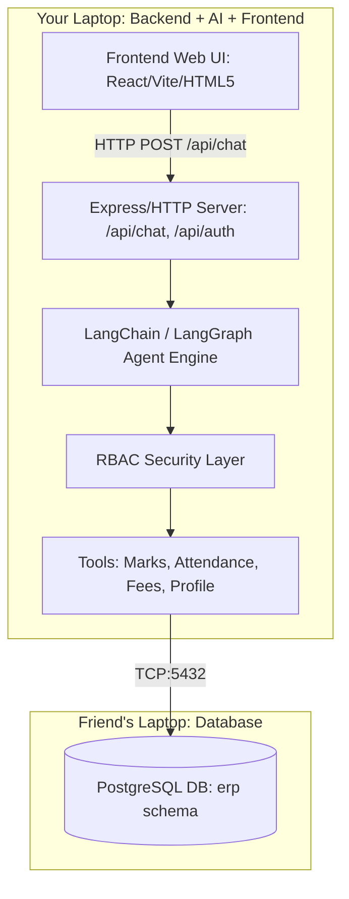

# GRADIT-CHATBOT (Laptop 2) — Complete Architecture & Execution Roadmap

---

## 1. Codebase Analysis (What You Currently Have)

Your current repository (`GRADIT-CHATBOT-main`) contains the core foundations of an **AI-powered College ERP Chatbot** built with Node.js and TypeScript:

### What's Implemented:
1. **Database Configuration (`src/config/database.ts`)**:
   - PostgreSQL connection pool using `pg`.
   - Configured to read `DB_HOST`, `DB_PORT`, `DB_USER`, `DB_PASSWORD`, and `DB_NAME` from `.env`.
2. **LLM Configuration (`src/llm/model.ts` & `src/config/env.ts`)**:
   - OpenRouter integration with LangChain (`@langchain/openrouter`).
   - Model configured (`openai/gpt-oss-120b`).
3. **Role-Based Access Control (RBAC) (`src/auth/`)**:
   - Roles: `ADMIN`, `FACULTY`, `STAFF`, `STUDENT`.
   - Permissions: `VIEW_STUDENT`, `VIEW_MARKS`, `VIEW_ATTENDANCE`, `VIEW_FEES`.
   - Logic: Students can only view their own marks/details; Admin/Faculty have higher access.
4. **Database Query Tools (`src/tools/`)**:
   - `marksTool.ts`: Queries `erp.marks` table with RBAC checks.
   - `studentTool.ts`: Verifies student identity and authorization.

---

## 2. What Is Missing (Next Steps Overview)



1. **Remote Connection Setup**: Connect Laptop 2 (Backend) to Laptop 1 (Friend's PostgreSQL DB).
2. **AI Agent Communication Engine**: Combine LLM + Tools into an autonomous LangGraph / LangChain tool-calling workflow that accepts student context.
3. **HTTP API Server**: Build an Express / REST server providing endpoints for `/api/chat`, `/api/auth`, `/api/health`.
4. **Remaining ERP Tools**: Attendance tool (`erp.attendance`), Fee status tool (`erp.fees`), Profile tool (`erp.students`).
5. **Modern Frontend Web UI**: A sleek, responsive dashboard with chat interface, role switcher (Student / Faculty / Admin), quick prompt chips, and tool execution logs.

---

## 3. How to Connect to Your Friend's Database Laptop

Follow these exact steps to connect your backend on **Laptop 2** to the PostgreSQL database running on **Laptop 1 (Friend's Laptop)**.

### Step A: On Your Friend's Laptop (Laptop 1)

#### 1. Put Both Laptops on the Same Network
- Connect both laptops to the same Wi-Fi router or one laptop's Mobile Hotspot.
- **Find Friend's IPv4 Address**:
  - Open Command Prompt / PowerShell on Laptop 1:
    ```powershell
    ipconfig
    ```
  - Look for `IPv4 Address` under Wireless LAN adapter (e.g., `192.168.1.45` or `192.168.137.xxx`).

#### 2. Configure PostgreSQL to Listen on All Interfaces
- Locate `postgresql.conf` (typically in `C:\Program Files\PostgreSQL\<version>\data\postgresql.conf`).
- Open it in a text editor as Administrator and set:
  ```ini
  listen_addresses = '*'
  ```

#### 3. Allow Remote Connections in `pg_hba.conf`
- In the same `data` folder, open `pg_hba.conf`.
- Add this line at the bottom:
  ```ini
  # Allow all connections from local network
  host    all             all             0.0.0.0/0               scram-sha-256
  ```
  *(If PostgreSQL version uses md5, change `scram-sha-256` to `md5`)*.

#### 4. Restart PostgreSQL Service
- Press `Win + R`, type `services.msc`, find `postgresql-x64-<version>`, and click **Restart**.

#### 5. Open Port 5432 in Windows Firewall
- Run PowerShell as Administrator on Laptop 1:
  ```powershell
  New-NetFirewallRule -DisplayName "PostgreSQL Port 5432" -Direction Inbound -LocalPort 5432 -Protocol TCP -Action Allow
  ```

---

### Step B: On Your Laptop (Laptop 2)

#### 1. Create or Update `.env`
Create a `.env` file in the root of `GRADIT-CHATBOT-main`:
```env
# Friend's Laptop Database Configuration
DB_HOST=192.168.1.45       # Replace with Friend's actual IPv4 address
DB_PORT=5432
DB_USER=postgres
DB_PASSWORD=your_friend_postgres_password
DB_NAME=gradit_erp         # Name of the database on friend's laptop

# OpenRouter LLM Key
OPENROUTER_API_KEY=sk-or-v1-xxxxxxxxxxxxxxxxxxxx

# Server Port
PORT=5000
```

#### 2. Test Connection
Run the database test script:
```powershell
npm run db:test
```
If configured correctly, you will see:
```
✅ PostgreSQL connected!
Database time: 2026-08-25T...
```

---

## 4. Communication Logic & Backend Pipeline

### 1. HTTP API Server (`src/server.ts`)
We will create an Express server with CORS and JSON parsing:
- `POST /api/chat`: Accepts `{ message, userId, role }` and streams or returns the AI response.
- `GET /api/health`: Verifies DB and LLM connection status.
- `POST /api/auth/login`: Mock/JWT authentication for switching between Student, Faculty, and Admin.

### 2. LangGraph / LangChain Agent (`src/agent/erpAgent.ts`)
- Bind tools (`getStudentMarks`, `getStudentDetails`, `getAttendance`, `getFeeStatus`).
- Set system prompt embedding user role & ID.
- Automatically execute tools when the user asks queries like:
  - *"What are my marks in Database Management?"*
  - *"Show student 102's attendance records"* (if Faculty/Admin).
  - *"What is my pending fee balance?"*

---

## 5. Modern Frontend Architecture

We will build a high-performance, responsive UI featuring:
- **Role Switcher Header**: Toggle instantly between Student (ID: 101), Faculty, and Admin to demo RBAC.
- **Glassmorphic Chat Interface**: Message bubbles, markdown formatting, real-time typing indicators.
- **Tool Inspection Drawer**: Visual cards showing database queries made (`erp.marks`, `erp.attendance`) and RBAC authorization pass/fail.
- **Quick Action Chips**: Instant clickable prompts (Marks, Attendance, Schedule, Fees).
